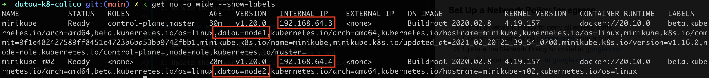
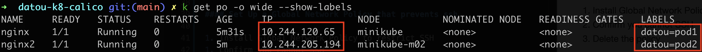

## datou-k8-calico
---

#### Overview

By default, Kubernetes uses a flat network topology. This doesn't follow conventional security practices to segment networks to reduce impact if any part of the network was compromised. 

#### Considerations

Kubernetes already has L3,4,7 network policies as a resource on the pod level. So why Calico? 

Calico offers more fine grained controls over L3,4 on the host and network level. Calico is a superset of functionality and also provides its own CNI implementation using an overlay network vs AWS CNI whose implementation relies on overloading additional IPs on one or more ENIs to achieve connectivity.

#### Pre-requisites

- Minikube - see [datou-k8](https://github.com/datou-tech/datou-k8)
- Install calicoctl - `brew install calicoctl`

#### Setting up

- Start minikube - `minikube start --network-plugin=cni --cni=calico  --driver=hyperkit --nodes 2`
- Fetch the name and IP of each node - `kubectl get no -o wide`

- Label each node - `label nodes minikube datou=node1` & `label nodes minikube-m02 datou=node2`
- Deploy an application using node affinity to node 1 - `kubectl apply -f app1.yaml`
- Deploy a second application on node 2 - `kubectl apply -f app2.yaml`
- Confirm the labels on the nodes and fetch the IP of each pod - `k get po -o wide --show-labels`

#### Baseline Network Tests

In this section, you will confirm connectivity between nodes and pods.

**Node Tests**
1. SSH onto the first node - `minikube ssh -n minikube`
1. while on node1, hit the application on your node - `curl <POD1_IP>:80`
1. while on node1, hit the application on the other node - `curl <POD2_IP>:80`
1. while on the node, ping your own node - `ping <NODE1_IP>`
1. while on the node, ping the other node - `ping <NODE2_IP>`
1. while on the node, hit google.com - `curl google.com`

**Container Tests**
1. SSH into the container on pod1 - `k exec -it nginx -- /bin/bash`
1. while in container, hit your own application via loopback - `curl 127.0.0.1:80`
1. while in container, hit your own application - `curl <POD1_IP>:80`
1. while in container, hit the application in the other pod -  `curl <POD2_IP>:80`
1. [OPTIONAL] you may need to install ping on your container - `apt update && apt install iputils-ping`
1. while in container, ping your own node -  `ping <NODE1_IP>`
1. while in container, ping the other node -  `ping <NODE2_IP>`
1. while in container, hit google.com - `curl google.com`

These steps will be referenced for the following tests.

#### K8 Network Policy to Deny Egress

1. Install a policy to deny all egress traffic - `kubectl apply -f k8-policy-deny-egress.yaml`
1. Confirm you cannot hit google.com from a container
1. Confirm you can hit google.com from the node (note this policy is pod level only - this is why hitting google.com works)
1. Delete the policy - `kubectl delete -f k8-policy-deny-egress.yaml`

#### Calico Global Network Policy That Denies Egress

1. Install Global Network Policy to egress traffic - `calicoctl apply -f calico-global-deny-egress.yaml`
1. Confirm you cannot hit google.com from a container
1. Confirm you can hit google.com from the node (this is the gap with L7 policy - it still has L3/4 vulnerability)
1. Delete the policy - `calicoctl delete -f calico-global-deny-egress.yaml`

#### Calico Network Policy To Deny Access From a Pod

1. Install Network Policy to restrict access from pod 2 to pod 1 - `calicoctl apply -f calico-pod1-deny-pod2.yaml`
1. SSH into pod 2 - `k exec -it nginx2 -- /bin/bash`
1. Attempt to hit pod 1 and confirm you cannot - `curl <POD_IP1>`
1. Delete the policy - `calicoctl delete -f calico-pod1-deny-pod2.yaml`

